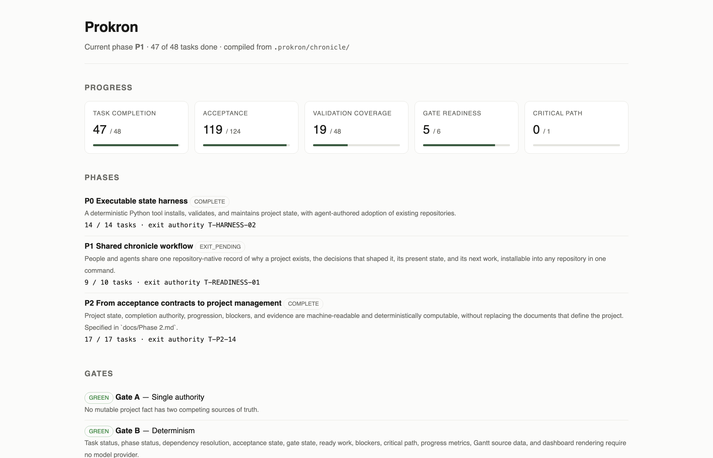
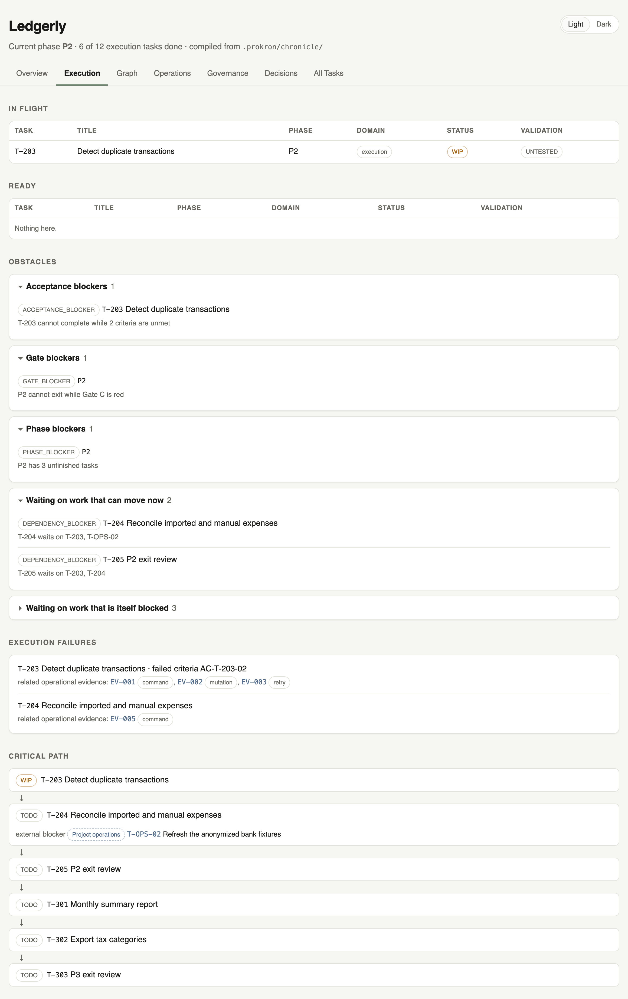
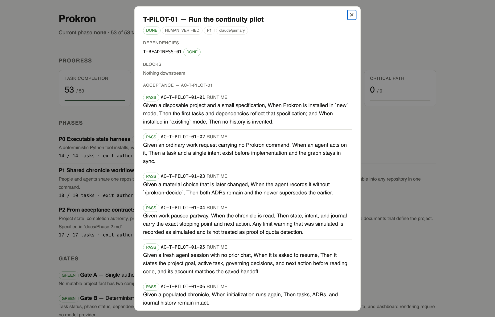
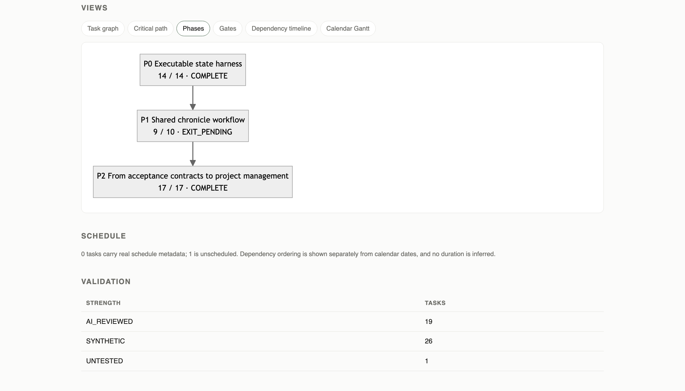
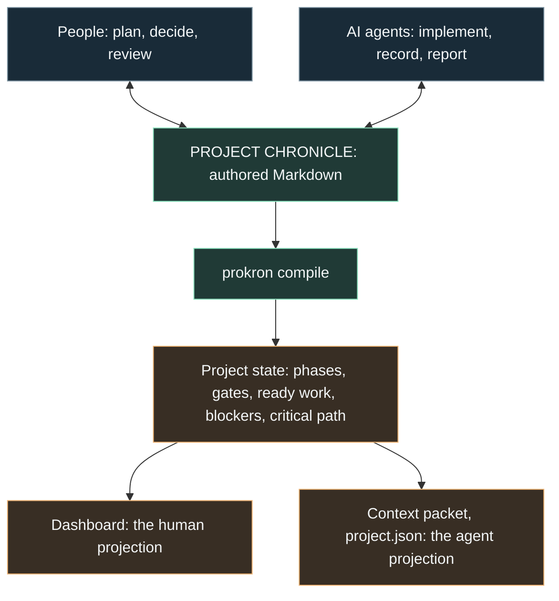

<p align="center">
  
</p>

# Prokron

**Prokron keeps people and AI agents working from the same project state.**

Project management that a person and an AI can both read. Prokron is short for
Project Chronicle.

[The problem](#the-problem) · [Get started](#get-started) ·
[Commands](#asking-the-project-questions) · [Specification](docs/SPEC.md) ·
[Thesis](docs/PRODUCT-THESIS.md)

## The problem

A coding session ends. The next one starts somewhere else — a new session, a
different model, another person, a parallel branch. The code survives. What the
code meant does not.

The next participant cannot tell from the repository which task was half
finished, which decision was reversed last month and why, what has to happen
before this work can start, or what would have to be true for anyone to call it
done. So they reconstruct it: read the diff, guess the intent, ask someone, or
quietly redo a decision that was already made.

This is usually described as an AI memory problem. It is not, or not only.
A single agent remembering its own conversation does not help the person
reviewing the work, the second agent picking it up, or the teammate who joins in
March. The useful question is not *what should this agent remember* but **what
should the project remember** — and the answer has to be readable by everyone
who touches it.

Prokron's answer: keep that in the repository, as Markdown, and compile it.

## One state, two readers

Your project's phases, tasks, dependencies, decisions and definition of done
live as Markdown inside your repository. A small deterministic tool compiles
those documents into project state, and that state is then projected two ways.

A person opens a page:

<p align="center">
  
</p>

<p align="center"><em><code>prokron dashboard</code>, generated from this repository's own chronicle.<br>
Every figure is computed from the Markdown files in <code>.prokron/chronicle/</code>. No model, no service, no network.</em></p>

An agent asks for a packet, and gets the same state as structured text:

```console
$ prokron context T-PILOT-01
{
  "role": "builder",
  "packetFor": "T-PILOT-01",
  "phase": { "id": "P1", "status": "COMPLETE", "outcome": "..." },
  "task": {
    "id": "T-PILOT-01",
    "status": "DONE",
    "validation": "HUMAN_VERIFIED",
    "dependencies": [ { "id": "T-READINESS-01", "done": true } ]
  },
  "blockers": [],
  "acceptance": [
    { "id": "AC-T-PILOT-01-01", "class": "RUNTIME", "state": "PASS",
      "text": "Given a disposable project and a small specification, When ..." }
  ],
  "decisions": [ { "id": "ADR-008", "title": "Make Prokron an agent working convention" } ],
  "handoff": "..."
}
```

Same project. Different interface. A project meeting and an agent session do not
need two versions of reality, and neither side has to translate for the other.

That is also the whole of it: **Prokron owns project understanding, not project
execution.** Claude, Codex, a person in an editor — they do the work. Prokron
keeps the record that lets each of them know where they are.

### A project story a newcomer can follow

A team is building an expense tool for freelancers. Months in, a new teammate —
or an AI advisor — asks why bank synchronization is absent:

| Question | Recorded answer |
|---|---|
| Why are we building this? | Help freelancers prepare expense records without maintaining a spreadsheet. |
| What did we originally choose? | `ADR-002` proposed bank synchronization to reduce manual entry. |
| Why did the direction change? | `ADR-007` superseded it: launch with CSV import, because supported banks did not cover the first users. Revisit when coverage improves. |
| Where is the project now? | Import is complete; duplicate detection is in progress; validation evidence is linked from the tasks. |
| What comes next? | Finish duplicate detection before starting monthly summaries. The task graph records that dependency. |

The teammate can explain the tradeoff. The advisor can question whether the
constraint still holds. The coding agent can choose work consistent with the
current decision. Nobody has to reconstruct it from commit messages.

*Illustrative example; these are not claims about a deployed project.*

## What the project remembers

Each record answers one question a project keeps being asked.

| The question | What answers it | Where it lives |
|---|---|---|
| What are we trying to do right now? | **Intent** — zero or one active task, at its exact stopping point | `INTENT.md` |
| What work exists? | **Tasks** — phase, owner, status, validation, evidence | `TASKS.md` |
| What has to happen first? | **Dependencies**, resolved into a graph of ready and blocked work | computed from `TASKS.md` |
| What counts as done? | **Acceptance** — a frozen contract per task, criterion by criterion | `ACCEPTANCE.md` |
| What phase are we in, and what must be true to leave it? | **Phases** and **gates** — outcome, entry, exit, exit authority | `PHASES.md` |
| What is stopping progress? | **Obstacles**, computed — dependency, acceptance, gate, phase, validation | computed |
| Why did we choose this? | **Decisions** — append-only, superseded rather than rewritten | `ADR/` |
| What happened recently? | **Journal** — progress, what was left mid-air, and why | `JOURNAL.md` |
| What does the next participant need? | **Handoff** — the baton, overwritten each checkpoint | `HANDOFF.md` |
| Why do we believe any of this? | **Evidence**, recorded against the criterion it satisfies | `ACCEPTANCE.md` |

Nothing here is a status report someone wrote by hand. It is computed from the
authored documents, so it cannot drift away from them.

<p align="center">
  
</p>

<p align="center"><em>What is in flight, what is ready, what blocks the project, and what lies on the critical path.<br>
Prokron reporting on itself with every phase closed: nothing in flight, no obstacles, no open work — and it says that plainly rather than inventing something to show.</em></p>

## Done is a contract, not an opinion

A task is not done because someone says it is done. It is done when every
mandatory criterion of its contract holds and its evidence is recorded.

Each criterion is written as Given / When / Then, carries an evidence class
(`TEST`, `MUTATION`, `INSPECTION`, `RUNTIME`, `MANUAL`), and holds a state. A
contract freezes the moment its task starts. Changing it afterwards takes an
Acceptance Change Request, not a quiet edit — and a reviewer's preference is not
an acceptance criterion.

Completion and confidence stay separate. A task can be `DONE` and still be
`UNTESTED`; only a named human may record `HUMAN_VERIFIED`, and only against
manual evidence.

<p align="center">
  
</p>

<p align="center"><em>Click any task for its contract, its criteria, and the evidence behind each one.<br>
This is the continuity pilot: seven criteria, three participants across two disposable projects, and the one validation state only a named human may record.</em></p>

That last part matters more than it looks. When two people — or two agents —
disagree about whether something is finished, the contract makes the
disagreement **decidable** instead of an argument. Prokron ships an explicit
arbitration order: product authority, then the contract, then invariants, then
accepted decisions, then reproducible evidence, then existing convention, and
only last, reviewer preference.

Taken together, that is as much governance as Prokron has, and it is deliberately
small: decisions are explicit and dated, dependencies are visible, completion has
conditions agreed in advance, conflicting evidence can be surfaced and settled by
a stated order — and no single participant owns the project's context.

### What it refuses to make up

A project tool that invents numbers is worse than no tool. Prokron reports a
duration only when someone recorded one, a date only when someone set one, and
`UNKNOWN` the rest of the time. Dependency ordering and calendar scheduling are
deliberately kept in separate views so one never quietly becomes the other.

Completion is also kept apart from confidence. The validation table counts how
strongly each finished task is actually backed, which is a different question
from whether it is done.

<p align="center">
  
</p>

<p align="center"><em>Six views of the same state: task graph, critical path, phases, gates, dependency ordering, and calendar Gantt.<br>
Below them, the schedule line says plainly that this project records no dates — rather than drawing a plausible one.</em></p>

## Get started

### 1. Install in your project

From the root of your project:

```sh
curl -fsSL https://raw.githubusercontent.com/qomero/prokron/main/install.sh | sh
```

Read the script before you pipe it to a shell, as you should with any installer
delivered this way.

The installer adds one directory, `.prokron/`, holding the chronicle, the
compiled views, the tool itself and the portable workflows. Outside it, it
writes only what an agent host reads by fixed address: `AGENTS.md`,
`CLAUDE.md`, and the command files for Codex, Claude Code, and OpenCode. It
preserves existing records and custom instructions, restores missing files, and
prints what to run next.

It also puts a small `prokron` launcher in a directory already on your `PATH`,
so the command is `prokron` from anywhere in the project. The launcher runs
each project's own copy, so two repositories on different releases stay
independent. It creates no directories, changes no shell configuration, and
never replaces a `prokron` it did not write — if there is nowhere to put it,
the installer says so and `.prokron/prokron` works exactly the same. Pass
`--no-link` to skip it.

<details>
<summary>Starting a new project, installing from a checkout, or using the GitHub CLI</summary>

Installing defaults to `existing`, which records from now on. A **new project**
starts from your product specification instead:

```sh
curl -fsSL https://raw.githubusercontent.com/qomero/prokron/main/install.sh | sh -s -- new
```

From a downloaded or cloned Prokron checkout, installation works offline:

```sh
sh ./install.sh /path/to/your/project
```

With an authenticated [GitHub CLI](https://cli.github.com/):

```sh
gh api -H 'Accept: application/vnd.github.raw+json' 'repos/qomero/prokron/contents/install.sh?ref=main' | sh
```

Every form takes an optional `new` or `existing`, an optional target
directory, and `--no-link`.

</details>

### 2. Start in your agent chat

| Agent host | Existing project | New project |
|---|---|---|
| Codex | `$prokron init existing` | `$prokron init new` |
| Claude Code / OpenCode | `/prokron-init existing` | `/prokron-init new` |
| Other capable coding agents | Read `AGENTS.md`, then follow `.prokron/commands/prokron-init.md` in existing mode. | Same instruction, in new mode. |

**New project:** the agent works from your product specification with you to
derive the initial phases, tasks, dependencies, and contracts.
**Existing project:** the chronicle starts empty and records from now on.
Earlier history is reconstructed only if you explicitly ask; Prokron does not
invent it. A populated chronicle is preserved if you initialize again.

### 3. Work normally

Ask for the work you want. The installed rules instruct the agent to create the
task before implementing, write its contract, append a decision when one is
made, and keep progress current — without a slash command for every update.

Then check it yourself:

```sh
prokron status
prokron dashboard && open .prokron/compiled/dashboard.html
```

A session then looks like this, and the loop is the point:

```text
you ask for work  →  agent claims a task, writes its contract, implements
                  →  agent records evidence, decisions, and where it stopped
                  →  prokron compile          state is recomputed
                  →  you read the dashboard   the next agent reads the packet
```

Use the chronicle in discussion and review, too: ask why a decision was made,
what changed, or which work actually serves the current goal.

## Asking the project questions

The tool is standard-library Python. No dependencies, no package to install, no
model provider, no network. Output for a given set of documents is identical
every time, which is what lets two agents and a person agree on the numbers.

```console
$ prokron status
Prokron — phase none
  tasks        53 / 53
  acceptance   146 / 146 criteria passing
  validation   20 / 53 reviewed or verified
  gates        6 / 6 green
  P0           14 / 14 · COMPLETE
  P1           10 / 10 · COMPLETE
  P2           17 / 17 · COMPLETE
  no phase     12 tasks

  WIP       none
  Ready     none
  Blocked   none
```

That is this repository at v0.4.2, reporting its own unfinished work.

```console
$ prokron explain T-PILOT-01
T-PILOT-01 — Run the continuity pilot
  phase P1 · DONE · HUMAN_VERIFIED

  Dependencies
    ✓ T-READINESS-01

  Acceptance
    ✓ AC-T-PILOT-01-01 [RUNTIME] Given a disposable project and a small specification, When Prokron is installed in `new` m
    ✓ AC-T-PILOT-01-02 [RUNTIME] Given an ordinary work request carrying no Prokron command, When an agent acts on it, Then
    ✓ AC-T-PILOT-01-03 [RUNTIME] Given a material choice that is later changed, When the agent records it without `/prokron
    ✓ AC-T-PILOT-01-04 [RUNTIME] Given work paused partway, When the chronicle is read, Then state, intent, and journal car
    ✓ AC-T-PILOT-01-05 [RUNTIME] Given a fresh agent session with no prior chat, When it is asked to resume, Then it states
    ✓ AC-T-PILOT-01-06 [RUNTIME] Given a populated chronicle, When initialization runs again, Then tasks, ADRs, and journal
    ✓ AC-T-PILOT-01-07 [MANUAL] Given a person who did not do the work, When they read the same chronicle, Then they can e

  Evidence: All seven criteria pass, recorded in `docs/pilot-2026-09-22.md`. The pilot was run in full against v0.4.0 across two disposable projects: Codex CLI 0.155.1 for install, work without a command, a decision and its reversal, stopping partway, and re-initializing over populated history; a Gemini 3.8 Flash session with no prior chat for a cold resume; and the product owner for the human reading. It supersedes the partial run of 2026-09-21, which was measured against v0.2.1 and cites an entry point and a directory that no longer exist. Two things remain unproven and are recorded as unproven: no host exposed a real limit warning to observe, and nothing was simulated in its place; and step 7 passed on the owner's attestation without a point-by-point account or a comparison against an agent's reading.
  Source:   TASKS.md → T-PILOT-01
```

| Command | Answers |
|---|---|
| `prokron status` | Where the project stands, what is ready, what blocks it. |
| `prokron explain <task>` | Why one task exists, its criteria, blockers, and evidence. |
| `prokron context <task>` | The minimal packet an agent needs to start that task. |
| `prokron validate` | Broken dependencies, dangling references, authority conflicts. |
| `prokron compile` | Rebuilds `.prokron/compiled/` from the authored documents. |
| `prokron graph` | The six Mermaid views of the same state. |
| `prokron dashboard` | The local page above: phases, gates, obstacles, graph, drill-down. |
| `prokron migrate` | Moves a chronicle written under an earlier layout into the current one. |

## How it works



People set direction, decide tradeoffs, and accept or reject completion. Agents
implement, record what they did, and produce evidence. Both maintain the same
files, and the compiler turns those files into the same state for everyone.

Because the compiler is deterministic, two agents reading the same project
return the same answer, and a person checking their work reads the same figures.
That is what "same language" means here: not a shared summary, but a shared
source and a shared way of computing from it.

### What lives where

Everything Prokron installs is inside one directory, and only one part of it is
authoritative.

```text
.prokron/
├── chronicle/   written by people and agents; the only source of truth
├── compiled/    generated; safe to delete and rebuild
├── commands/    the workflows an agent follows
├── runtime/     the tool's own code
└── prokron      the command
```

| File in `.prokron/chronicle/` | What it holds |
|---|---|
| **`ACCEPTANCE.md`** | The bar: what must be demonstrated before work counts as done. |
| **`ADR/`** | The reasoning: append-only decisions and their supersession chain. |
| `PHASES.md` | The arc: maturity stages, exit conditions, exit authority, and gates. |
| `TASKS.md` | The work: phase, owner, dependencies, status, validation, evidence. |
| `INTENT.md` | The focus: zero or one active task and its exact execution point. |
| `HANDOFF.md` | The baton: what the next person or agent needs right now. |
| `JOURNAL.md` | The diary: progress, validation, what was left mid-air, and why. |

`.prokron/compiled/` holds the generated views: a state snapshot, the task
graph, a `project.json` for other tools, Mermaid diagrams, and the dashboard.
Delete that directory and `prokron compile` rebuilds it byte for byte. Nothing
in it is authority, and nothing in it decides a question the authored files
answer.

Prokron's own records are a live example: its
[task graph](.prokron/compiled/TASK_GRAPH.md),
[contracts](.prokron/chronicle/ACCEPTANCE.md),
[decisions](.prokron/chronicle/ADR/), and
[chronicle guide](.prokron/chronicle/README.md).

The [specification](docs/SPEC.md) defines the record format, the working
lifecycle, and the invariants. The [product thesis](docs/PRODUCT-THESIS.md) goes
into why the model is shaped this way.

## What is verified, and what is not

**Implemented and tested.** The compiler and its eight commands, acceptance
contracts with evidence, phases, gates, computed obstacles, the critical path,
the dashboard, and the context packet. 119 unit tests plus an installer
regression suite, and deleting the compiled directory reproduces every generated
file byte for byte:

```sh
rm -rf .prokron/compiled && prokron compile && prokron graph
```

Two different coding agents have audited the same implementation against the
same contract and reached the same verdicts, after a real disagreement that the
arbitration order settled.

**Not yet proven.** Prokron's rules ask an agent to checkpoint before a handoff,
compaction, session end, or any known or estimated context, token, time, rate,
or quota limit. **Prokron cannot read hidden quota counters or guarantee a
final write after an abrupt cutoff.** The
[continuity pilot](docs/SPEC.md#handoff-pilot) has now been run in full against
this release and all seven of its criteria pass
([results](docs/pilot-2026-09-22.md)) — but no host exposed a real limit
warning to observe, and nothing was simulated in its place. Checkpointing
against an actual quota boundary is therefore still untested rather than
passed. The human reading also passed on the owner's attestation, without a
point-by-point comparison against an agent's account of the same chronicle.

**Designed, not built.** Later phases are specified in internal working
documents and are not part of this release. Nothing in this README describes
them, and no command implements them yet.

Run the checks yourself from a checkout:

```sh
sh tests/install.sh
python3 -m unittest discover -s tests
```

## Commands

Use these when you want to invoke a workflow explicitly.

| Purpose | Claude Code / OpenCode | Codex |
|---|---|---|
| Initialize | `/prokron-init [new\|existing]` | `$prokron init [new\|existing]` |
| Start or continue a task | `/prokron-work [task]` | `$prokron work [task]` |
| Record or supersede a decision | `/prokron-decide [decision]` | `$prokron decide [decision]` |
| Save a handoff | `/prokron-checkpoint` | `$prokron checkpoint` |
| Recover current work | `/prokron-resume` | `$prokron resume` |

All workflows also install as portable Markdown prompts in
`.prokron/commands/`, which any capable agent can follow directly.

### Use the model you prefer

Prokron configures the **agent host** that reads files and does the work. GLM,
MiniMax, Mistral, Grok, and other models use the same chronicle through a
compatible host; provider setup and model selection stay with that host.

Codex receives a project skill. Claude Code and OpenCode receive project
commands. Hosts that load [`AGENTS.md`](https://agents.md/) can follow the shared
rules; for other capable agents, ask them explicitly to read it and follow the
relevant file in `.prokron/commands/`.

For OpenCode setup, see its [providers](https://opencode.ai/docs/providers),
[instructions](https://opencode.ai/docs/rules/), and
[custom commands](https://opencode.ai/docs/commands/) documentation.

## Releases

`VERSION` holds the current release and [`CHANGELOG.md`](CHANGELOG.md) summarises
what changed. The full history lives in the chronicle itself:
[decisions](.prokron/chronicle/ADR/) and [journal](.prokron/chronicle/JOURNAL.md).

### Upgrading from an earlier layout

v0.2 moved authority out of `.prokron/` and into `prokron/` at the repository
root. v0.3 moved everything Prokron owns back inside `.prokron/`, as
`chronicle/` and `compiled/`. Either way your records are intact but in the old
place, and the tool reports an empty project until you move them:

```sh
prokron migrate           # shows what it would do
prokron migrate --apply   # performs it
```

Coming from v0.2 this is a relocation: every record moves byte for byte and
nothing is rewritten. Coming from v0.1 it is a rewrite — prose acceptance
becomes contracts and one decisions file becomes an ADR directory — so the
originals are archived untouched beside the new ones.

### Updating an installation

Reinstalling adds missing files; it **does not upgrade existing guidance**, and
it prints a reminder when guidance is retained. From a current checkout, review
and merge changes to:

- `.prokron/commands/`, `.claude/commands/`, and `.opencode/commands/`;
- `.agents/skills/prokron/SKILL.md`;
- `templates/chronicle/README.md`, installed as `.prokron/chronicle/README.md`;
- the Prokron block in `AGENTS.md`, preserving surrounding project rules.

Keep customizations and every chronicle record. Never copy empty templates over
project history.

## Documentation

| Document | What it covers |
|---|---|
| [`docs/SPEC.md`](docs/SPEC.md) | The record format, working lifecycle, invariants, scope, and the continuity pilot. |
| [`docs/PRODUCT-THESIS.md`](docs/PRODUCT-THESIS.md) | Why shared project state, and how the model is built. |
| [`CONTRIBUTING.md`](CONTRIBUTING.md) | How a change is accepted here: a task, a contract, evidence. |
| [`SECURITY.md`](SECURITY.md) | What is in scope, and how to report privately. |
| [`.prokron/chronicle/README.md`](.prokron/chronicle/README.md) | The read order and working rules an agent follows. |
| [`CHANGELOG.md`](CHANGELOG.md) | What changed in each release. |

## Help improve it

Try the [continuity pilot](docs/SPEC.md#handoff-pilot) in a disposable project.
When reporting a gap, include the host and model, the request, what was
recorded, and what a person or agent could not understand from it. Remove
private project details before sharing.

Changes should keep Prokron small and readable.
[`CONTRIBUTING.md`](CONTRIBUTING.md) describes how a change is accepted — a
task, a frozen contract, and evidence, which is the same workflow the tool
installs. The [specification](docs/SPEC.md) defines the working agreement and
scope.

## Qomero

Built by Qomero, and used to run Qomero's own projects. Prokron is the record of
how we think a human and an AI should share one project.

## License

Apache-2.0. See [LICENSE](LICENSE), [NOTICE](NOTICE), and
[TRADEMARKS.md](TRADEMARKS.md).
