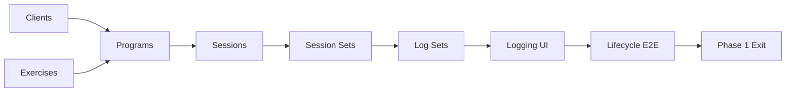

# Prokron Phase 2

## From Acceptance Contracts to Project Management

### Status

Development specification.

### Objective

Phase 2 evolves Prokron from a continuity and multi-agent handoff layer into a
filesystem-native project cognition and project-management layer.

The core objective is:

> Make project state, completion authority, progression, blockers, and evidence
> machine-readable without replacing the repository documents that define the
> project.

Prokron must remain:

* filesystem-native;
* Git-native;
* local-first;
* agent-readable;
* human-readable;
* model-agnostic;
* derived-state oriented.

It must **not** become a Jira clone or introduce a second mutable project
database.

---

# 1. Problem

Phase 1 solves continuity reasonably well.

Agents can understand:

* what is happening;
* what has already happened;
* what the current intent is;
* what work exists;
* what depends on what.

It does not yet fully solve:

```text
When is a task actually DONE?

What evidence proves that?

Which project phase are we in?

What prevents the project from progressing?

Which tasks are on the critical path?

Which gates are green or red?

What can start now?

What should an auditor verify?

How can humans see all of this without reading every Markdown file?
```

Without explicit completion authority, multiple agents tend to disagree based
on their own engineering preferences.

The purpose of Phase 2 is not to eliminate disagreement.

It is to make disagreement **decidable against project authority**.

---

# 2. Core model

Phase 2 establishes the following Prokron primitives:

```text
Intent
Phase
Task
Acceptance
Invariant
Decision
Evidence
Handoff
```

`Task Graph` is not a separate source-of-truth primitive.

It is a derived graph composed from relationships between tasks.

Likewise, `Current State` is derived from task state, phase state, evidence,
acceptance, and handoff information.

The conceptual hierarchy becomes:

```text
PRODUCT INTENT
      │
      ▼
    PHASE
      │
      ▼
    TASK
      │
      ├── Acceptance
      ├── Invariants
      ├── Decisions
      └── Evidence
      │
      ▼
   HANDOFF
```

Dependency relationships exist horizontally:

```text
Task A ──→ Task B ──→ Task C
```

---

# 3. Authority model

Phase 2 must make document authority explicit.

## 3.1 Product documents

```text
Product Thesis
→ product intent authority

Product Spec
→ behaviour and business-rule authority

Technical Design
→ engineering constraint authority

Implementation Plan
→ sequencing and planned delivery authority
```

Ambiguous names such as `blueprint` and `superstructure` should not be used as
additional authority layers.

They may be migrated or aliased, but agents must not treat them as independent
sources of truth.

---

## 3.2 Execution documents

```text
PHASES.md
→ phase outcome, entry, exit, and phase status authority

TASKS.md
→ task identity, dependency, ownership, execution state,
  validation state, and evidence registry authority

ACCEPTANCE.md
→ completion-contract authority

ADR/
→ accepted engineering decision authority

INTENT.md
→ current authorized work intent

HANDOFF.md
→ current implementation continuity
```

Derived artifacts have no authority:

```text
TASK_GRAPH.md
project.json
Mermaid graphs
HTML dashboard
Gantt views
CLI summaries
agent context packets
```

They may report authority.

They may never silently modify it.

---

# 4. Acceptance contracts

Acceptance is the first major capability added in Phase 2.

## 4.1 Purpose

A task must not be considered complete because a builder says:

```text
DONE
```

A task is complete when its frozen completion contract has sufficient evidence.

Acceptance answers:

> What must be demonstrated before this work is allowed to become DONE?

---

## 4.2 File

Create:

```text
ACCEPTANCE.md
```

This becomes the authority for expanded task completion contracts.

---

## 4.3 Contract identity

Criteria use stable identifiers:

```text
AC-T057-01
AC-T057-02
AC-T057-03
```

A task-level contract can be referenced as:

```text
AC-T057
```

---

## 4.4 Criterion structure

Prefer observable behaviour:

```text
Given <precondition>
When  <action>
Then  <observable outcome>
```

Every criterion records its required evidence class.

Supported evidence classes:

```text
TEST
MUTATION
INSPECTION
RUNTIME
MANUAL
```

---

## 4.5 Inherited acceptance

Some requirements apply to categories of tasks rather than one individual
task.

Example:

```text
AC-GLOBAL-DB-TENANCY
```

It may enforce:

```text
RLS enabled
tenant table registered
no unintended anon grants
tenant-safe foreign keys
cross-tenant application-path isolation
```

Tasks inheriting such contracts must satisfy them automatically.

They must not duplicate these requirements in every task row.

---

## 4.6 Blocking reviewer findings

A reviewer finding blocks completion only when classified as:

```text
ACCEPTANCE_FAILURE
INVARIANT_VIOLATION
REGRESSION
MISSING_EVIDENCE
```

The following are informative but non-blocking by default:

```text
RISK
MAINTAINABILITY
ARCHITECTURE_PREFERENCE
STYLE
FUTURE_IMPROVEMENT
```

Reviewer preference does not create a new acceptance criterion.

---

## 4.7 Frozen contracts

Acceptance contracts freeze when implementation begins.

Builders and reviewers cannot silently reinterpret them.

A required change becomes an:

```text
Acceptance Change Request
```

containing:

```text
Task
Criterion
Current contract
Proposed contract
Reason
Impact
Decision
```

Until explicitly accepted, the existing criterion remains authoritative.

---

# 5. Acceptance migration

Avoid a period of dual authority.

Migration occurs in two states.

## Before migration

`TASKS.md` acceptance cells remain authoritative.

## Migration command

Prokron converts each task's existing acceptance statement into a stable
acceptance contract.

Example:

```text
T057
Acceptance:
Program targets pre-populated; last performance inline;
repeat-last-set in one tap; optimistic write with visible failure
```

becomes:

```text
AC-T057-01
AC-T057-02
AC-T057-03
AC-T057-04
...
```

After migration validation succeeds:

```text
TASKS.md
```

changes from:

```text
| Acceptance |
```

to:

```text
| AC |
```

and stores:

```text
AC-T057
```

Only then does `ACCEPTANCE.md` become completion authority.

The transition must be atomic from Prokron's perspective.

---

# 6. Phase as a first-class primitive

Phase 2 adds explicit project phases.

A Phase answers:

> What capability or maturity level must become true before the project moves
> forward?

Phase is not simply a collection of tasks.

---

# 7. PHASES.md

Create:

```text
PHASES.md
```

Each phase contains only:

```text
ID
Name
Outcome
Entry criteria
Exit criteria
Exit authority
Status
```

Example:

```text
P1 — Operational Foundation

Outcome:
Trainer can operate the core workflow without AI.

Entry:
project scaffold exists

Exit:
Gate A
Gate B
Gate C
Gate D
Lifecycle E2E
Phase exit review

Exit authority:
T106

Status:
ACTIVE
```

Do not duplicate every task inside `PHASES.md`.

Task membership comes from task metadata.

---

# 8. Phase metadata on tasks

Each task gains:

```text
Phase
```

The task schema becomes conceptually:

```text
ID
Phase
Task
Deps
AC
Status
Validation
Owner
Evidence
```

Example:

```text
T057 | P1 | Live session logging UI | T052 | AC-T057 | TODO | UNTESTED | — | —
```

This allows phase progress to be compiled instead of manually maintained.

---

# 9. Phase, milestone, and gate

These must remain separate concepts.

## Phase

Large product maturity stage.

Example:

```text
P1 — Operational Foundation
```

## Milestone

Meaningful capability achieved inside a phase.

Example:

```text
session/workout/entitlement backend complete
```

Milestones are optional.

## Gate

An explicit invariant or release condition that must pass.

Example:

```text
Gate A — canonical exercise identity
Gate C — immutable history
Gate E — AI provenance
```

A gate may block phase progression.

It is not itself a phase.

---

# 10. Normalized project state

Prokron must not make every renderer independently parse Markdown.

Introduce a compiler boundary:

```text
Authority Markdown
       │
       ▼
 Prokron compiler
       │
       ▼
   project.json
```

`project.json` is derived and disposable.

It can always be regenerated.

---

# 11. project.json

Minimum conceptual shape:

```json
{
  "project": {
    "name": "AuxVol",
    "currentPhase": "P1"
  },

  "phases": [],

  "tasks": [],

  "acceptance": {},

  "invariants": [],

  "gates": [],

  "milestones": [],

  "obstacles": [],

  "criticalPath": [],

  "schedule": {},

  "handoff": {},

  "sources": {}
}
```

---

## 11.1 Source provenance

Every compiled object should retain provenance where practical.

Example:

```json
{
  "id": "T057",
  "source": {
    "file": "TASKS.md",
    "anchor": "T057"
  }
}
```

This allows:

```text
dashboard → task → authoritative source
```

without making the dashboard authoritative.

---

# 12. Compiler validation

`prokron compile` must fail or report structural errors for conditions such as:

```text
unknown dependency
duplicate task ID
unknown phase
missing acceptance contract
duplicate acceptance ID
task references missing ADR
dependency cycle
phase exit task missing
gate references unknown task
DONE task with unresolved mandatory AC
invalid status
invalid validation state
```

Warnings may be used for non-fatal conditions.

Example:

```text
TODO task has evidence
active phase has no exit authority
scheduled task has no estimate
```

---

# 13. Derived project-management state

From `project.json`, Prokron computes:

```text
ready tasks
blocked tasks
current work
dependency blockers
acceptance blockers
phase blockers
gate blockers
critical path
phase progress
validation coverage
gate readiness
```

No LLM is required for these calculations.

They should be deterministic.

---

# 14. Obstacles engine

The dashboard must answer:

> What is preventing progression?

Obstacle types:

```text
DEPENDENCY_BLOCKER
ACCEPTANCE_BLOCKER
GATE_BLOCKER
PHASE_BLOCKER
VALIDATION_GAP
SCHEDULE_BLOCKER
```

Example:

```text
T105 blocked

Dependency blockers:
- T057
- T065
- T077
- T084
```

Another:

```text
T057 completion blocked

AC-T057-03 FAIL
AC-T057-04 NOT_RUN
```

Another:

```text
P1 cannot exit

Gate A: RED
Gate B: RED
Gate C: GREEN
Gate D: GREEN
Lifecycle E2E: RED
```

Obstacle generation must be deterministic from state.

LLMs may explain obstacles later, but they do not determine whether one exists.

---

# 15. Progress metrics

Do not report only:

```text
tasks done / tasks total
```

because tasks differ materially in importance.

The dashboard should show multiple independent metrics.

Minimum metrics:

```text
Task completion
Phase completion
Critical-path completion
Validation coverage
Gate readiness
Acceptance completion
```

Example:

```text
Task completion       31 / 121
Phase 1 completion    31 / 78
Gate readiness         2 / 4
Validation coverage   31 / 121
Critical path          derived separately
```

Do not create arbitrary weighted progress until explicit effort metadata exists.

---

# 16. Scheduling model

Task dependencies are not dates.

Prokron must not hallucinate schedules.

Scheduling metadata is optional.

Example:

```yaml
schedule:
  start: 2026-09-22
  estimate: 2d
```

or:

```yaml
schedule:
  estimate: 4h
```

Without schedule metadata:

```text
schedule: unscheduled
```

---

# 17. Two Gantt modes

Prokron must distinguish:

## Dependency timeline

Shows ordering only.

Example:

```text
T006 ━━━
       T015 ━━━
       T016 ━━
                 T105 ━━
```

It does not claim calendar dates.

## Calendar Gantt

Requires sufficient schedule metadata:

```text
start
estimate or end
```

Only then may Prokron generate a date-based Gantt chart.

No fake duration estimation.

No implicit AI scheduling in Phase 2.

---

# 18. Mermaid renderer

Mermaid is a derived visualization layer.

Generate at minimum:

```text
task graph
phase flow
gate graph
critical path
dependency timeline
calendar Gantt when schedulable
```

Example:



Generated Mermaid files contain no authoritative state.

---

# 19. HTML5 project-management dashboard

Generate a local static dashboard.

Initial implementation should use:

```text
HTML
CSS
JavaScript
Mermaid
project.json
```

Do not introduce React, a backend, authentication, or a persistent dashboard DB
unless a future requirement proves they are necessary.

The initial dashboard should work as a generated static artifact.

Example output:

```text
.prokron/
├── project.json
├── dashboard.html
├── task-graph.mmd
├── critical-path.mmd
├── phases.mmd
└── gantt.mmd
```

---

# 20. Dashboard information architecture

The primary page should expose:

```text
PROJECT HEADER
Current phase
Overall state

PHASE PROGRESS
P1 / P2 / P3

GATES
Green / red / pending

CURRENT WORK
WIP tasks
Ready tasks

OBSTACLES
Dependency blockers
Acceptance blockers
Gate blockers

CRITICAL PATH
Current longest dependency chain

TASK GRAPH
Mermaid visualization

GANTT
Dependency or calendar view

VALIDATION
UNTESTED
SYNTHETIC
AI_REVIEWED
HUMAN_VERIFIED
```

---

# 21. Task drill-down

Selecting a task should expose:

```text
Task ID
Title
Phase
Status
Validation
Owner

Dependencies
Downstream blockers

Acceptance criteria
PASS / FAIL / NOT_RUN

Inherited invariants

Evidence

Relevant ADRs

Current handoff context

Source document
```

Example:

```text
T057 — Live session logging UI

Phase       P1
Status      TODO
Validation  UNTESTED

Deps
✓ T052

Acceptance
○ AC-T057-01
○ AC-T057-02
○ AC-T057-03
○ AC-T057-04

Blocks
T105

Evidence
—

Source
TASKS.md → T057
```

---

# 22. Dashboard edit policy

The Phase 2 dashboard is read-only.

No button may directly mutate project authority.

If a future version adds editing, edits must resolve back into authoritative
Markdown changes through an explicit command and Git diff.

Phase 2 does not implement this.

---

# 23. CLI surface

Recommended initial CLI:

```text
prokron validate
prokron compile
prokron status
prokron graph
prokron dashboard
prokron explain <task-id>
prokron context <task-id>
```

---

## 23.1 `prokron validate`

Validate authority files and cross-document references.

---

## 23.2 `prokron compile`

Generate:

```text
.prokron/project.json
```

and derived state.

---

## 23.3 `prokron status`

Print concise project state:

```text
Current phase
Progress
WIP
Ready
Blocked
Gate status
Critical path next
```

---

## 23.4 `prokron graph`

Generate Mermaid graph artifacts.

---

## 23.5 `prokron dashboard`

Compile state and generate/open:

```text
.prokron/dashboard.html
```

---

## 23.6 `prokron explain T057`

Return deterministic structured information about one task:

```text
why it exists
phase
dependencies
acceptance
invariants
blockers
evidence
downstream impact
```

This should not require an LLM.

---

## 23.7 `prokron context T057`

Generate a minimal agent context packet.

Example:

```text
Intent
Current phase
Task
Acceptance
Inherited invariants
Relevant decisions
Dependencies
Relevant handoff
Evidence state
```

This becomes a major token-saving mechanism for multi-agent work.

---

# 24. Agent workflow

Phase 2 formalizes the builder/reviewer contract.

## Builder

Receives:

```text
Intent
Phase
Task
Acceptance
Invariants
Relevant ADRs
Relevant handoff
```

Builder may:

```text
implement
test
produce evidence
raise acceptance change request
update handoff
```

Builder may not silently weaken acceptance.

---

## Reviewer

Receives the same contract plus implementation evidence and diff.

Reviewer reports findings against:

```text
Acceptance
Invariant
Regression
Evidence
```

Reviewer may separately report preferences.

Preferences do not block DONE.

---

# 25. Multi-agent arbitration

Prokron does not attempt model consensus.

Example:

```text
Codex Builder
Claude Reviewer
Codex Verifier
```

They may disagree.

The deciding hierarchy is:

```text
1. Product / domain authority
2. Explicit acceptance contract
3. Invariants
4. ADRs / accepted decisions
5. Reproducible tests and evidence
6. Existing code convention
7. Reviewer preference
```

The system optimizes for:

> make disagreements decidable

not:

> make agents agree

---

# 26. Project explanation layer

Once `project.json` exists, an optional AI layer may consume a compact packet.

Example:

```text
Current phase: P1

Progress:
31 DONE / 121

Ready:
T006
T015
...

Obstacles:
Gate A incomplete
T105 blocked by T057/T065/T077/T084

Critical path next:
T006

Recent handoff:
...
```

An agent may then answer:

```text
What should I work on now?
Why is Phase 1 blocked?
What changed since the last session?
What prevents T105?
```

The LLM explains compiled state.

It does not invent compiled state.

---

# 27. Phase 2 implementation slices

## P2.1 — Acceptance foundation

Implement:

```text
ACCEPTANCE.md schema
acceptance parser
criterion IDs
evidence classes
inherited contracts
review finding taxonomy
acceptance change requests
```

Exit:

```text
tasks can resolve to stable acceptance contracts
```

---

## P2.2 — Authority migration

Implement:

```text
TASKS acceptance → AC reference migration
authority validation
duplicate/conflict detection
```

Exit:

```text
one unambiguous completion authority exists
```

---

## P2.3 — Phase primitive

Implement:

```text
PHASES.md
phase parser
phase membership
phase entry/exit
phase status
phase gates
```

Exit:

```text
current phase and phase readiness are deterministic
```

---

## P2.4 — Project compiler

Implement:

```text
normalized internal model
project.json
source provenance
cross-file validation
```

Exit:

```text
all project state can be deterministically regenerated
```

---

## P2.5 — Project analytics

Implement:

```text
ready tasks
blocked tasks
obstacles
phase progress
acceptance progress
gate readiness
validation coverage
critical path
```

Exit:

```text
Prokron can explain project state without an LLM
```

---

## P2.6 — Mermaid visualization

Implement:

```text
task graph
critical path
phase map
gate graph
dependency timeline
```

Exit:

```text
project structure can be visually inspected
```

---

## P2.7 — Static dashboard

Implement:

```text
dashboard.html
summary metrics
phase progress
gates
current work
obstacles
critical path
task drill-down
Mermaid embedding
```

Exit:

```text
one command produces a complete local project dashboard
```

---

## P2.8 — Scheduling and Gantt

Implement:

```text
optional schedule metadata
dependency timeline
calendar Gantt
unscheduled-state handling
```

Exit:

```text
Gantt never invents dates or durations
```

---

## P2.9 — Agent context compiler

Implement:

```text
prokron context <task>
minimal builder packet
minimal reviewer packet
handoff integration
```

Exit:

```text
new agents can enter work without rescanning the full repository
```

---

# 28. Phase 2 non-goals

Do not build:

```text
Jira replacement
cloud project database
multi-user collaboration server
issue tracker
human time tracking
AI-generated duration estimates
automatic project scheduling
LLM-based dependency inference as authority
editable web dashboard
Kanban mutation UI
GitHub Issues synchronization
Slack integration
notifications
mobile app
```

These may be future integrations.

They are not necessary to prove the Phase 2 architecture.

---

# 29. Generated-state rule

Everything under:

```text
.prokron/
```

is generated.

It should be safe to delete:

```bash
rm -rf .prokron
prokron compile
```

and recover the same logical state from authoritative documents.

This is a core architectural invariant.

---

# 30. Determinism rule

The following must not require an LLM:

```text
task status
phase status
dependency resolution
acceptance state
gate state
ready work
blockers
critical path
progress metrics
Gantt source data
dashboard rendering
```

LLMs may:

```text
explain
summarize
audit
suggest
implement
```

They must not become the hidden source of project state.

---

# 31. Phase 2 Definition of Done

Prokron Phase 2 is complete when:

### Acceptance

Every task can resolve to an explicit completion contract.

### Phase awareness

Every task belongs to a known phase or an explicitly phase-independent class.

### Authority

No mutable project fact has two competing sources of truth.

### Compilation

All authority documents compile into a normalized `project.json`.

### Validation

Broken dependencies, acceptance references, phase references, and authority
conflicts are detected.

### Project management

Prokron can deterministically report:

```text
current phase
progress
current work
ready work
blockers
obstacles
gates
validation coverage
critical path
```

### Visualization

Prokron generates:

```text
Mermaid task graph
critical-path graph
phase/gate views
static HTML5 dashboard
```

### Scheduling

Gantt output distinguishes dependency ordering from real calendar scheduling
and never fabricates dates.

### Agent interoperability

Two different coding agents can receive the same task context packet and audit
against the same completion contract.

### Regeneration

Deleting `.prokron/` and rebuilding reproduces the same derived logical state.

---

# 32. Product principle

Phase 2 should make Prokron:

> A repository-native project cognition layer that gives humans and agents one
> shared, evidence-backed understanding of what the project is doing, what is
> done, what is blocked, and what may happen next.

It should not become another project-management system that must itself be
managed.
